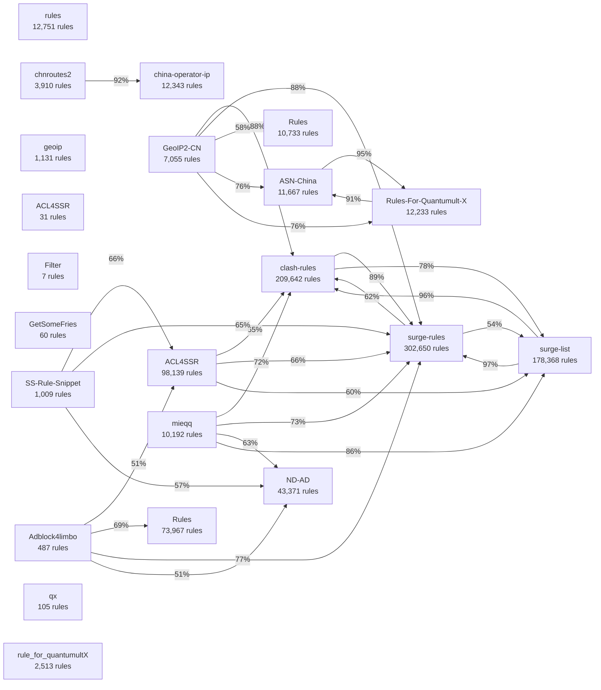

# Vendor Repo Analysis Report

Analysed **36** vendor repos referenced in `source/categories.yaml`.

## Repo Summary

| Repo | Rules | Unique | Unique% | Comments% | Exotic | Types | Score | Label |
|---|---:|---:|---:|---:|---:|---:|---:|---|
| `Loyalsoldier/surge-rules` | 302,650 | 107,924 | 36% | 0% | 0 | 4 | 4/12 | mixed |
| `Loyalsoldier/clash-rules` | 209,642 | 12,642 | 6% | 0% | 0 | 0 | 1/12 | likely auto-generated |
| `geekdada/surge-list` | 178,368 | 5,821 | 3% | 0% | 0 | 0 | 0/12 | likely auto-generated |
| `ACL4SSR/ACL4SSR` | 98,139 | 33,754 | 34% | 1% | 200 | 8 | 6/12 | mixed |
| `LM-Firefly/Rules` | 73,967 | 44,085 | 60% | 2% | 102 | 7 | 8/12 | likely curated |
| `NobyDa/ND-AD` | 43,371 | 21,458 | 49% | 0% | 0 | 0 | 2/12 | likely auto-generated |
| `666OS/rules` | 12,751 | 7,018 | 55% | 1% | 153 | 5 | 7/12 | mixed |
| `gaoyifan/china-operator-ip` | 12,343 | 6,678 | 54% | 0% | 0 | 0 | 3/12 | likely auto-generated |
| `sve1r/Rules-For-Quantumult-X` | 12,233 | 250 | 2% | 0% | 5 | 9 | 3/12 | likely auto-generated |
| `missuo/ASN-China` | 11,667 | 488 | 4% | 0% | 0 | 0 | 0/12 | likely auto-generated |
| `dler-io/Rules` | 10,733 | 4,214 | 39% | 1% | 0 | 0 | 2/12 | likely auto-generated |
| `mieqq/mieqq` | 10,192 | 5,238 | 51% | 0% | 0 | 0 | 3/12 | likely auto-generated |
| `NobyDa/Script` | 9,721 | 8 | 0% | 0% | 116 | 5 | 5/12 | mixed |
| `Hackl0us/GeoIP2-CN` | 7,055 | 564 | 8% | 0% | 0 | 0 | 2/12 | likely auto-generated |
| `misakaio/chnroutes2` | 3,910 | 240 | 6% | 0% | 0 | 0 | 2/12 | likely auto-generated |
| `scomper/surge-list` | 3,225 | 9 | 0% | 1% | 24 | 5 | 5/12 | mixed |
| `zqzess/rule_for_quantumultX` | 2,513 | 1,021 | 41% | 2% | 0 | 7 | 6/12 | mixed |
| `blackmatrix7/ios_rule_script` | 1,737 | 968 | 56% | 32% | 30 | 9 | 10/12 | likely curated |
| `Loyalsoldier/geoip` | 1,131 | 1,060 | 94% | 0% | 0 | 0 | 4/12 | mixed |
| `QiuSimons/Netflix_IP` | 1,118 | 6 | 1% | 0% | 0 | 0 | 1/12 | likely auto-generated |
| `Hackl0us/SS-Rule-Snippet` | 1,009 | 12 | 1% | 1% | 19 | 7 | 4/12 | mixed |
| `limbopro/Adblock4limbo` | 487 | 312 | 64% | 22% | 34 | 3 | 10/12 | likely curated |
| `an0na/R` | 174 | 0 | 0% | 0% | 0 | 4 | 5/12 | mixed |
| `GeQ1an/Rules` | 158 | 0 | 0% | 1% | 0 | 8 | 5/12 | mixed |
| `tengyuankoo/qx` | 105 | 102 | 97% | 12% | 0 | 4 | 10/12 | likely curated |
| `VirgilClyne/GetSomeFries` | 60 | 55 | 92% | 30% | 0 | 4 | 10/12 | likely curated |
| `Mazetsz/ACL4SSR` | 31 | 3 | 10% | 26% | 0 | 2 | 7/12 | mixed |
| `tkzc11/QX-Rules` | 17 | 0 | 0% | 0% | 1 | 3 | 5/12 | mixed |
| `luuanng/surge` | 13 | 0 | 0% | 39% | 0 | 3 | 6/12 | mixed |
| `StricklandF/Filter` | 7 | 7 | 100% | 2% | 0 | 3 | 7/12 | mixed |
| `LuzMasonj/Quantumult` | 0 | 0 | 0% | 14% | 0 | 1 | 5/12 | mixed |
| `Semporia/Quantumult-X` | 0 | 0 | 0% | 5% | 0 | 4 | 6/12 | mixed |
| `imDazui/Tvlist-awesome-m3u-m3u8` | 0 | 0 | 0% | 50% | 0 | 0 | 5/12 | mixed |
| `ngosang/trackerslist` | 0 | 0 | 0% | 0% | 0 | 0 | 3/12 | likely auto-generated |
| `tugepaopao/Image-Storage` | 0 | 0 | 0% | 15% | 0 | 2 | 6/12 | mixed |
| `yjqiang/surge_scripts` | 0 | 0 | 0% | 40% | 0 | 1 | 5/12 | mixed |

## Coverage Matrix

_Cell = % of **row** repo's rules subsumed by **column** repo._  Only repos with ≥1 strong edge (≥50%, ≥50 rules) shown.

| Repo \ Covered by | ACL4SSR | Rules | GeoIP2-CN | SS-Rule-Snippet | Rules | clash-rules | surge-rules | ND-AD | Script | Netflix_IP | R | Rules | china-operator-ip | surge-list | Adblock4limbo | mieqq | chnroutes2 | ASN-China | surge-list | Rules-For-Quantumult-X | rule_for_quantumultX |
|---|---|---|---|---|---|---|---|---|---|---|---|---|---|---|---|---|---|---|---|---|---|
| `ACL4SSR` |  —  | 0% | 0% | 2% | 15% | 66% | 66% | 6% | 2% | 1% | 0% | 3% | 0% | 61% | 0% | 1% | 0% | 0% | 1% | 0% | 1% |
| `Rules` | 53% |  —  | 0% | 15% | 40% | 9% | 5% | 0% | 35% | 0% | 30% | 61% | 0% | 0% | 0% | 0% | 0% | 0% | 13% | 84% | 47% |
| `GeoIP2-CN` | 0% | 0% |  —  | 0% | 0% | 88% | 88% | 0% | 0% | 0% | 0% | 59% | 24% | 0% | 0% | 0% | 22% | 76% | 0% | 76% | 0% |
| `SS-Rule-Snippet` | 67% | 2% | 0% |  —  | 46% | 38% | 65% | 58% | 59% | 0% | 1% | 48% | 0% | 23% | 3% | 12% | 0% | 0% | 49% | 2% | 1% |
| `Rules` | 20% | 0% | 0% | 11% |  —  | 25% | 33% | 12% | 5% | 0% | 0% | 11% | 0% | 16% | 1% | 1% | 0% | 0% | 3% | 1% | 0% |
| `clash-rules` | 33% | 0% | 3% | 2% | 15% |  —  | 90% | 4% | 1% | 0% | 0% | 4% | 2% | 79% | 0% | 1% | 1% | 3% | 0% | 3% | 0% |
| `surge-rules` | 22% | 0% | 2% | 1% | 10% | 62% |  —  | 3% | 1% | 0% | 0% | 3% | 1% | 55% | 0% | 0% | 1% | 2% | 0% | 2% | 0% |
| `ND-AD` | 23% | 0% | 0% | 16% | 24% | 26% | 44% |  —  | 26% | 0% | 0% | 15% | 0% | 32% | 1% | 5% | 0% | 0% | 10% | 0% | 0% |
| `Script` | 37% | 1% | 0% | 29% | 37% | 21% | 58% | 98% |  —  | 0% | 2% | 25% | 0% | 40% | 3% | 9% | 0% | 0% | 35% | 2% | 2% |
| `Netflix_IP` | 76% | 0% | 0% | 0% | 2% | 0% | 0% | 0% | 0% |  —  | 0% | 0% | 0% | 0% | 0% | 0% | 0% | 0% | 0% | 2% | 96% |
| `R` | 11% | 27% | 0% | 8% | 0% | 0% | 0% | 0% | 100% | 0% |  —  | 0% | 0% | 0% | 0% | 0% | 0% | 0% | 11% | 100% | 91% |
| `Rules` | 8% | 1% | 38% | 4% | 6% | 48% | 44% | 0% | 0% | 0% | 0% |  —  | 17% | 0% | 0% | 0% | 14% | 40% | 0% | 41% | 0% |
| `china-operator-ip` | 0% | 0% | 14% | 0% | 0% | 27% | 27% | 0% | 0% | 0% | 0% | 15% |  —  | 0% | 0% | 0% | 29% | 14% | 0% | 14% | 0% |
| `surge-list` | 38% | 0% | 0% | 3% | 16% | 96% | 97% | 9% | 3% | 0% | 0% | 3% | 0% |  —  | 0% | 3% | 0% | 0% | 2% | 0% | 0% |
| `Adblock4limbo` | 51% | 0% | 0% | 35% | 69% | 37% | 78% | 52% | 42% | 0% | 0% | 38% | 0% | 47% |  —  | 18% | 0% | 0% | 16% | 0% | 0% |
| `mieqq` | 48% | 0% | 0% | 17% | 35% | 73% | 73% | 64% | 33% | 0% | 0% | 11% | 0% | 87% | 4% |  —  | 0% | 0% | 14% | 0% | 0% |
| `chnroutes2` | 1% | 0% | 39% | 0% | 0% | 40% | 40% | 0% | 0% | 0% | 0% | 38% | 92% | 0% | 0% | 0% |  —  | 36% | 0% | 36% | 0% |
| `ASN-China` | 0% | 0% | 46% | 0% | 0% | 47% | 47% | 0% | 0% | 0% | 0% | 37% | 15% | 0% | 0% | 0% | 12% |  —  | 0% | 96% | 0% |
| `surge-list` | 63% | 1% | 0% | 50% | 61% | 29% | 77% | 97% | 98% | 0% | 1% | 41% | 0% | 85% | 6% | 17% | 0% | 0% |  —  | 1% | 1% |
| `Rules-For-Quantumult-X` | 1% | 1% | 44% | 0% | 4% | 45% | 45% | 0% | 2% | 0% | 1% | 36% | 14% | 0% | 0% | 0% | 12% | 91% | 0% |  —  | 3% |
| `rule_for_quantumultX` | 38% | 3% | 0% | 1% | 5% | 0% | 0% | 0% | 7% | 43% | 6% | 1% | 0% | 0% | 0% | 0% | 0% | 0% | 1% | 13% |  —  |

## Full Coverage Matrix (all repos)

| Repo | rules | ACL4SSR | Rules | GeoIP2-CN | SS-Rule-Snippet | Rules | clash-rules | geoip | surge-rules | Quantumult | ACL4SSR | ND-AD | Script | Netflix_IP | Quantumult-X | Filter | GetSomeFries | R | ios_rule_script | Rules | china-operator-ip | surge-list | Tvlist-awesome-m3u-m3u8 | Adblock4limbo | surge | mieqq | chnroutes2 | ASN-China | trackerslist | surge-list | Rules-For-Quantumult-X | qx | QX-Rules | Image-Storage | surge_scripts | rule_for_quantumultX |
|---|---|---|---|---|---|---|---|---|---|---|---|---|---|---|---|---|---|---|---|---|---|---|---|---|---|---|---|---|---|---|---|---|---|---|---|---|
| `rules` | — | 10% | 0% | 0% | 3% | 30% | 41% | 0% | 9% | 0% | 0% | 0% | 0% | 0% | 0% | 0% | 0% | 0% | 2% | 7% | 0% | 1% | 0% | 0% | 0% | 0% | 0% | 0% | 0% | 0% | 0% | 0% | 0% | 0% | 0% | 0% |
| `ACL4SSR` | 2% | — | 0% | 0% | 2% | 15% | 66% | 0% | 66% | 0% | 0% | 6% | 2% | 0% | 0% | 0% | 0% | 0% | 0% | 3% | 0% | 61% | 0% | 0% | 0% | 0% | 0% | 0% | 0% | 0% | 0% | 0% | 0% | 0% | 0% | 0% |
| `Rules` | 13% | 53% | — | 0% | 15% | 40% | 9% | 13% | 5% | 0% | 0% | 0% | 35% | 0% | 0% | 0% | 1% | 30% | 9% | 61% | 0% | 0% | 0% | 0% | 0% | 0% | 0% | 0% | 0% | 13% | 84% | 0% | 0% | 0% | 0% | 47% |
| `GeoIP2-CN` | 0% | 0% | 0% | — | 0% | 0% | 88% | 0% | 88% | 0% | 0% | 0% | 0% | 0% | 0% | 0% | 0% | 0% | 0% | 59% | 24% | 0% | 0% | 0% | 0% | 0% | 22% | 76% | 0% | 0% | 76% | 0% | 0% | 0% | 0% | 0% |
| `SS-Rule-Snippet` | 11% | 67% | 2% | 0% | — | 46% | 38% | 0% | 65% | 0% | 0% | 58% | 59% | 0% | 0% | 0% | 0% | 1% | 5% | 48% | 0% | 23% | 0% | 3% | 0% | 12% | 0% | 0% | 0% | 49% | 2% | 0% | 0% | 0% | 0% | 1% |
| `Rules` | 6% | 20% | 0% | 0% | 11% | — | 25% | 0% | 33% | 0% | 0% | 12% | 5% | 0% | 0% | 0% | 0% | 0% | 0% | 11% | 0% | 16% | 0% | 0% | 0% | 1% | 0% | 0% | 0% | 3% | 0% | 0% | 0% | 0% | 0% | 0% |
| `clash-rules` | 3% | 33% | 0% | 3% | 2% | 15% | — | 0% | 90% | 0% | 0% | 4% | 0% | 0% | 0% | 0% | 0% | 0% | 0% | 4% | 2% | 79% | 0% | 0% | 0% | 0% | 0% | 3% | 0% | 0% | 3% | 0% | 0% | 0% | 0% | 0% |
| `geoip` | 0% | 3% | 2% | 0% | 0% | 4% | 1% | — | 1% | 0% | 0% | 0% | 0% | 1% | 0% | 0% | 0% | 0% | 0% | 2% | 0% | 0% | 0% | 0% | 0% | 0% | 0% | 0% | 0% | 0% | 5% | 0% | 0% | 0% | 0% | 1% |
| `surge-rules` | 0% | 22% | 0% | 2% | 1% | 10% | 62% | 0% | — | 0% | 0% | 3% | 0% | 0% | 0% | 0% | 0% | 0% | 0% | 3% | 1% | 55% | 0% | 0% | 0% | 0% | 0% | 2% | 0% | 0% | 2% | 0% | 0% | 0% | 0% | 0% |
| `Quantumult` | N/A | N/A | N/A | N/A | N/A | N/A | N/A | N/A | N/A | — | N/A | N/A | N/A | N/A | N/A | N/A | N/A | N/A | N/A | N/A | N/A | N/A | N/A | N/A | N/A | N/A | N/A | N/A | N/A | N/A | N/A | N/A | N/A | N/A | N/A | N/A |
| `ACL4SSR` | 6% | 90% | 0% | 0% | 32% | 90% | 3% | 0% | 35% | 0% | — | 6% | 0% | 0% | 0% | 0% | 0% | 0% | 0% | 29% | 0% | 0% | 0% | 0% | 0% | 0% | 0% | 0% | 0% | 0% | 0% | 0% | 0% | 0% | 0% | 48% |
| `ND-AD` | 2% | 23% | 0% | 0% | 16% | 24% | 26% | 0% | 44% | 0% | 0% | — | 26% | 0% | 0% | 0% | 0% | 0% | 0% | 15% | 0% | 32% | 0% | 0% | 0% | 5% | 0% | 0% | 0% | 10% | 0% | 0% | 0% | 0% | 0% | 0% |
| `Script` | 4% | 37% | 0% | 0% | 29% | 37% | 21% | 0% | 58% | 0% | 0% | 98% | — | 0% | 0% | 0% | 0% | 2% | 2% | 25% | 0% | 40% | 0% | 3% | 0% | 9% | 0% | 0% | 0% | 35% | 2% | 0% | 0% | 0% | 0% | 2% |
| `Netflix_IP` | 0% | 76% | 0% | 0% | 0% | 2% | 0% | 1% | 0% | 0% | 0% | 0% | 0% | — | 0% | 0% | 0% | 0% | 0% | 0% | 0% | 0% | 0% | 0% | 0% | 0% | 0% | 0% | 0% | 0% | 2% | 0% | 0% | 0% | 0% | 96% |
| `Quantumult-X` | N/A | N/A | N/A | N/A | N/A | N/A | N/A | N/A | N/A | N/A | N/A | N/A | N/A | N/A | — | N/A | N/A | N/A | N/A | N/A | N/A | N/A | N/A | N/A | N/A | N/A | N/A | N/A | N/A | N/A | N/A | N/A | N/A | N/A | N/A | N/A |
| `Filter` | 0% | 0% | 0% | 0% | 0% | 0% | 0% | 0% | 0% | 0% | 0% | 0% | 0% | 0% | 0% | — | 0% | 0% | 0% | 0% | 0% | 0% | 0% | 0% | 0% | 0% | 0% | 0% | 0% | 0% | 0% | 0% | 0% | 0% | 0% | 0% |
| `GetSomeFries` | 15% | 28% | 3% | 0% | 30% | 52% | 2% | 0% | 57% | 0% | 2% | 5% | 2% | 0% | 0% | 0% | — | 0% | 7% | 37% | 2% | 3% | 0% | 0% | 0% | 0% | 2% | 0% | 0% | 2% | 5% | 0% | 0% | 0% | 0% | 7% |
| `R` | 0% | 11% | 27% | 0% | 8% | 0% | 0% | 0% | 0% | 0% | 0% | 0% | 100% | 0% | 0% | 0% | 0% | — | 0% | 0% | 0% | 0% | 0% | 0% | 0% | 0% | 0% | 0% | 0% | 11% | 100% | 0% | 0% | 0% | 0% | 91% |
| `ios_rule_script` | 19% | 38% | 0% | 0% | 19% | 44% | 50% | 0% | 35% | 0% | 0% | 11% | 8% | 0% | 0% | 0% | 0% | 0% | — | 27% | 0% | 7% | 0% | 2% | 0% | 2% | 0% | 0% | 0% | 6% | 1% | 0% | 0% | 0% | 0% | 0% |
| `Rules` | 5% | 8% | 0% | 38% | 4% | 6% | 48% | 0% | 44% | 0% | 0% | 0% | 0% | 0% | 0% | 0% | 0% | 0% | 0% | — | 17% | 0% | 0% | 0% | 0% | 0% | 14% | 40% | 0% | 0% | 41% | 0% | 0% | 0% | 0% | 0% |
| `china-operator-ip` | 0% | 0% | 0% | 14% | 0% | 0% | 27% | 0% | 27% | 0% | 0% | 0% | 0% | 0% | 0% | 0% | 0% | 0% | 0% | 15% | — | 0% | 0% | 0% | 0% | 0% | 29% | 14% | 0% | 0% | 14% | 0% | 0% | 0% | 0% | 0% |
| `surge-list` | 0% | 38% | 0% | 0% | 3% | 16% | 96% | 0% | 97% | 0% | 0% | 9% | 3% | 0% | 0% | 0% | 0% | 0% | 0% | 3% | 0% | — | 0% | 0% | 0% | 3% | 0% | 0% | 0% | 2% | 0% | 0% | 0% | 0% | 0% | 0% |
| `Tvlist-awesome-m3u-m3u8` | N/A | N/A | N/A | N/A | N/A | N/A | N/A | N/A | N/A | N/A | N/A | N/A | N/A | N/A | N/A | N/A | N/A | N/A | N/A | N/A | N/A | N/A | — | N/A | N/A | N/A | N/A | N/A | N/A | N/A | N/A | N/A | N/A | N/A | N/A | N/A |
| `Adblock4limbo` | 6% | 51% | 0% | 0% | 35% | 69% | 37% | 0% | 78% | 0% | 0% | 52% | 42% | 0% | 0% | 0% | 0% | 0% | 6% | 38% | 0% | 47% | 0% | — | 0% | 18% | 0% | 0% | 0% | 16% | 0% | 0% | 0% | 0% | 0% | 0% |
| `surge` | 46% | 54% | 0% | 0% | 0% | 100% | 77% | 0% | 15% | 0% | 0% | 8% | 0% | 0% | 0% | 0% | 0% | 0% | 8% | 15% | 0% | 0% | 0% | 0% | — | 0% | 0% | 0% | 0% | 0% | 0% | 0% | 0% | 0% | 0% | 0% |
| `mieqq` | 7% | 48% | 0% | 0% | 17% | 35% | 73% | 0% | 73% | 0% | 0% | 64% | 33% | 0% | 0% | 0% | 0% | 0% | 2% | 11% | 0% | 87% | 0% | 4% | 0% | — | 0% | 0% | 0% | 14% | 0% | 0% | 0% | 0% | 0% | 0% |
| `chnroutes2` | 0% | 0% | 0% | 39% | 0% | 0% | 40% | 0% | 40% | 0% | 0% | 0% | 0% | 0% | 0% | 0% | 0% | 0% | 0% | 38% | 92% | 0% | 0% | 0% | 0% | 0% | — | 36% | 0% | 0% | 36% | 0% | 0% | 0% | 0% | 0% |
| `ASN-China` | 0% | 0% | 0% | 46% | 0% | 0% | 47% | 0% | 47% | 0% | 0% | 0% | 0% | 0% | 0% | 0% | 0% | 0% | 0% | 37% | 15% | 0% | 0% | 0% | 0% | 0% | 12% | — | 0% | 0% | 96% | 0% | 0% | 0% | 0% | 0% |
| `trackerslist` | N/A | N/A | N/A | N/A | N/A | N/A | N/A | N/A | N/A | N/A | N/A | N/A | N/A | N/A | N/A | N/A | N/A | N/A | N/A | N/A | N/A | N/A | N/A | N/A | N/A | N/A | N/A | N/A | — | N/A | N/A | N/A | N/A | N/A | N/A | N/A |
| `surge-list` | 9% | 63% | 0% | 0% | 50% | 61% | 29% | 0% | 77% | 0% | 0% | 97% | 98% | 0% | 0% | 0% | 0% | 0% | 3% | 41% | 0% | 85% | 0% | 6% | 0% | 17% | 0% | 0% | 0% | — | 0% | 0% | 0% | 0% | 0% | 0% |
| `Rules-For-Quantumult-X` | 0% | 0% | 1% | 44% | 0% | 4% | 45% | 0% | 45% | 0% | 0% | 0% | 2% | 0% | 0% | 0% | 0% | 1% | 0% | 36% | 14% | 0% | 0% | 0% | 0% | 0% | 12% | 91% | 0% | 0% | — | 0% | 0% | 0% | 0% | 3% |
| `qx` | 0% | 4% | 0% | 0% | 0% | 0% | 4% | 0% | 2% | 0% | 0% | 0% | 0% | 0% | 0% | 0% | 0% | 0% | 0% | 2% | 0% | 0% | 0% | 0% | 0% | 0% | 0% | 0% | 0% | 0% | 0% | — | 0% | 0% | 0% | 0% |
| `QX-Rules` | 0% | 6% | 6% | 0% | 0% | 100% | 0% | 6% | 0% | 0% | 0% | 0% | 0% | 0% | 0% | 0% | 0% | 0% | 53% | 6% | 0% | 0% | 0% | 0% | 0% | 0% | 0% | 0% | 0% | 0% | 41% | 0% | — | 0% | 0% | 0% |
| `Image-Storage` | N/A | N/A | N/A | N/A | N/A | N/A | N/A | N/A | N/A | N/A | N/A | N/A | N/A | N/A | N/A | N/A | N/A | N/A | N/A | N/A | N/A | N/A | N/A | N/A | N/A | N/A | N/A | N/A | N/A | N/A | N/A | N/A | N/A | — | N/A | N/A |
| `surge_scripts` | N/A | N/A | N/A | N/A | N/A | N/A | N/A | N/A | N/A | N/A | N/A | N/A | N/A | N/A | N/A | N/A | N/A | N/A | N/A | N/A | N/A | N/A | N/A | N/A | N/A | N/A | N/A | N/A | N/A | N/A | N/A | N/A | N/A | N/A | — | N/A |
| `rule_for_quantumultX` | 0% | 38% | 3% | 0% | 0% | 5% | 0% | 0% | 0% | 0% | 0% | 0% | 7% | 43% | 0% | 0% | 0% | 6% | 0% | 1% | 0% | 0% | 0% | 0% | 0% | 0% | 0% | 0% | 0% | 0% | 13% | 0% | 0% | 0% | 0% | — |

## Dependency Graph Edges

Edges where B covers ≥50% of A and ≥50 absolute rules.

- `ACL4SSR/ACL4SSR` → `Loyalsoldier/surge-rules`: 66% (64,800/98,139 rules covered)
- `ACL4SSR/ACL4SSR` → `Loyalsoldier/clash-rules`: 66% (64,370/98,139 rules covered)
- `ACL4SSR/ACL4SSR` → `geekdada/surge-list`: 61% (59,791/98,139 rules covered)
- `GeQ1an/Rules` → `sve1r/Rules-For-Quantumult-X`: 84% (132/158 rules covered)
- `GeQ1an/Rules` → `dler-io/Rules`: 61% (97/158 rules covered)
- `GeQ1an/Rules` → `ACL4SSR/ACL4SSR`: 53% (83/158 rules covered)
- `Hackl0us/GeoIP2-CN` → `Loyalsoldier/clash-rules`: 88% (6,221/7,055 rules covered)
- `Hackl0us/GeoIP2-CN` → `Loyalsoldier/surge-rules`: 88% (6,221/7,055 rules covered)
- `Hackl0us/GeoIP2-CN` → `sve1r/Rules-For-Quantumult-X`: 76% (5,381/7,055 rules covered)
- `Hackl0us/GeoIP2-CN` → `missuo/ASN-China`: 76% (5,380/7,055 rules covered)
- `Hackl0us/GeoIP2-CN` → `dler-io/Rules`: 59% (4,129/7,055 rules covered)
- `Hackl0us/SS-Rule-Snippet` → `ACL4SSR/ACL4SSR`: 67% (674/1,009 rules covered)
- `Hackl0us/SS-Rule-Snippet` → `Loyalsoldier/surge-rules`: 65% (659/1,009 rules covered)
- `Hackl0us/SS-Rule-Snippet` → `NobyDa/Script`: 59% (592/1,009 rules covered)
- `Hackl0us/SS-Rule-Snippet` → `NobyDa/ND-AD`: 58% (585/1,009 rules covered)
- `Loyalsoldier/clash-rules` → `Loyalsoldier/surge-rules`: 90% (188,075/209,642 rules covered)
- `Loyalsoldier/clash-rules` → `geekdada/surge-list`: 79% (164,984/209,642 rules covered)
- `Loyalsoldier/surge-rules` → `Loyalsoldier/clash-rules`: 62% (188,443/302,650 rules covered)
- `Loyalsoldier/surge-rules` → `geekdada/surge-list`: 55% (165,071/302,650 rules covered)
- `NobyDa/Script` → `NobyDa/ND-AD`: 98% (9,501/9,721 rules covered)
- `NobyDa/Script` → `Loyalsoldier/surge-rules`: 58% (5,626/9,721 rules covered)
- `QiuSimons/Netflix_IP` → `zqzess/rule_for_quantumultX`: 96% (1,071/1,118 rules covered)
- `QiuSimons/Netflix_IP` → `ACL4SSR/ACL4SSR`: 76% (846/1,118 rules covered)
- `an0na/R` → `NobyDa/Script`: 100% (174/174 rules covered)
- `an0na/R` → `sve1r/Rules-For-Quantumult-X`: 100% (174/174 rules covered)
- `an0na/R` → `zqzess/rule_for_quantumultX`: 91% (158/174 rules covered)
- `geekdada/surge-list` → `Loyalsoldier/surge-rules`: 97% (173,619/178,368 rules covered)
- `geekdada/surge-list` → `Loyalsoldier/clash-rules`: 96% (172,051/178,368 rules covered)
- `limbopro/Adblock4limbo` → `Loyalsoldier/surge-rules`: 78% (379/487 rules covered)
- `limbopro/Adblock4limbo` → `LM-Firefly/Rules`: 69% (338/487 rules covered)
- `limbopro/Adblock4limbo` → `NobyDa/ND-AD`: 52% (251/487 rules covered)
- `limbopro/Adblock4limbo` → `ACL4SSR/ACL4SSR`: 51% (249/487 rules covered)
- `mieqq/mieqq` → `geekdada/surge-list`: 87% (8,850/10,192 rules covered)
- `mieqq/mieqq` → `Loyalsoldier/surge-rules`: 73% (7,448/10,192 rules covered)
- `mieqq/mieqq` → `Loyalsoldier/clash-rules`: 73% (7,421/10,192 rules covered)
- `mieqq/mieqq` → `NobyDa/ND-AD`: 64% (6,472/10,192 rules covered)
- `misakaio/chnroutes2` → `gaoyifan/china-operator-ip`: 92% (3,611/3,910 rules covered)
- `missuo/ASN-China` → `sve1r/Rules-For-Quantumult-X`: 96% (11,147/11,667 rules covered)
- `scomper/surge-list` → `NobyDa/Script`: 98% (3,172/3,225 rules covered)
- `scomper/surge-list` → `NobyDa/ND-AD`: 97% (3,133/3,225 rules covered)
- `scomper/surge-list` → `geekdada/surge-list`: 85% (2,747/3,225 rules covered)
- `scomper/surge-list` → `Loyalsoldier/surge-rules`: 77% (2,476/3,225 rules covered)
- `scomper/surge-list` → `ACL4SSR/ACL4SSR`: 63% (2,016/3,225 rules covered)
- `scomper/surge-list` → `LM-Firefly/Rules`: 61% (1,966/3,225 rules covered)
- `scomper/surge-list` → `Hackl0us/SS-Rule-Snippet`: 50% (1,615/3,225 rules covered)
- `sve1r/Rules-For-Quantumult-X` → `missuo/ASN-China`: 91% (11,147/12,233 rules covered)

## Dependency Graph

_Edge A → B means B covers ≥50% of A's rules (≥50 rules). Dropped/zero-rule repos excluded._

